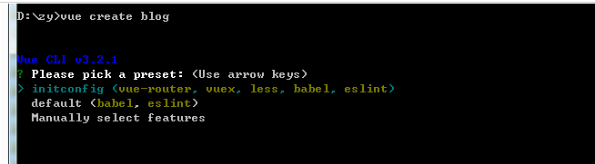
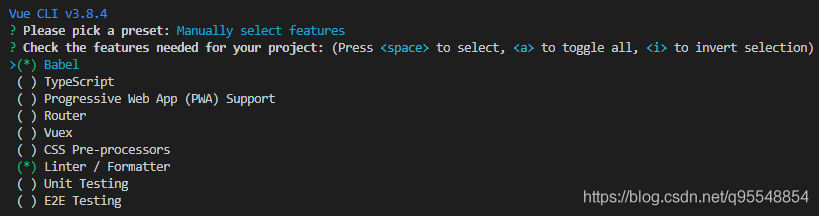

# 初识 Vue 3.js
[[toc]]

## Vue.js 是什么
Vue （读音 /vjuː/，类似于 view) 是一套用于构建用户界面的渐进式框架。  
与其它大型框架不同的是，Vue 被设计为可以自底向上逐层应用。  
Vue 的核心库只关注视图层，不仅易于上手，还便于与第三方库或既有项目整合。  
另一方面，当与现代化的工具链以及各种支持类库结合使用时，  
Vue 也完全能够为复杂的单页应用提供驱动.

## vue 3.js 安装
**1. 在页面上以 CDN 包的形式导入。**
```
<script src="https://unpkg.com/vue@next"></script>
```

**2. 下载 JavaScript 文件独立使用**
```
我们可以在 Vue.js 的官网上直接下载 vue.min.js 并用 <script> 标签引入。
```
**3. npm安装**  
在用 Vue 构建大型应用时推荐使用 npm 安装。npm 能很好地和诸如 [webpack](https://webpack.js.org/) 或 [Rollup](https://rollupjs.org/guide/en/) 模块打包器配合使用。
```
# 最新稳定版
$ npm install vue@next
```
::: warning 使用淘宝 NPM 镜像
大家都知道国内直接使用 npm 的官方镜像是非常慢的，这里推荐使用淘宝 NPM 镜像。  
淘宝 NPM 镜像是一个完整 npmjs.org 镜像，你可以用此代替官方版本(只读)，同步频率目前为 10分钟 一次以保证尽量与官方服务同步。  
你可以使用淘宝定制的 cnpm (gzip 压缩支持) 命令行工具代替默认的 npm:  
:::
```
$ npm install -g cnpm --registry=https://registry.npm.taobao.org
```
这样就可以使用 cnpm 命令来安装模块了：
```
$ cnpm install [name]
```
**4. 命令行工具 (CLI)**  
Vue 提供了一个官方的 CLI，为单页面应用 (SPA) 快速搭建繁杂的脚手架。它为现代前端工作流提供了功能齐备的构建设置。
只需要几分钟的时间就可以运行起来并带有热重载、保存时 lint 校验，以及生产环境可用的构建版本。更多详情可查阅 [Vue CLI](https://cli.vuejs.org/zh/) 的文档。
```
1.全局安装 
$ npm install -g @vue/cli 或 $ yarn global add @vue/cli
2.查看版本 
$ vue -v  或  $ vue --version
3.创建vue项目
$ vue create hello-world
```

**然后会弹出如下界面**  
  
**此处有以下选择**：  
1. 选择配置,第一次创建项目,只有后面两个,分别是默认和手动自定义选择。第一个是我创建过后保存的,这里选择最后一个,手动选择配置
2. default (babel, eslint) 默认套餐，提供 babel 和 eslint 支持。  
3. Manually select features 自己去选择需要的功能，提供更多的特性选择。比如如果想要支持 TypeScript,就应该选择这一项。  
4. 可以使用上下方向键来切换选项。如果只需要 babel 和 eslint 支持，那么选择第一项，就完事了，静静等待 vue 初始化项目。 

**如果想要更多的支持，就选择第二项：切换到第二项，按下 enter 键选中，弹出如下界面：**
 
**vue-cli 内置支持了8个功能特性，可以多选：使用方向键在特性选项之间切换，使用空格键选中当前特性，使用 a 键切换选择所有，使用 i 键翻转选项。
对于每一项的功能，此处做个简单描述：**

+ Babel 支持使用babel做转义。
+ TypeScript 支持使用 TypeScript 书写源码。
+ Progressive Web App (PWA) Support PWA 支持。
+ Router 支持 vue-router 。
+ Vuex 支持 vuex 。
+ CSS Pre-processors 支持 CSS 预处理器。
+ Linter / Formatter 支持代码风格检查和格式化。
+ Unit Testing 支持单元测试。
+ E2E Testing 支持 E2E 测试。

**那么基于开发常见的项目，同时兼顾项目健壮性的原则，本次选择如下特性支持：**