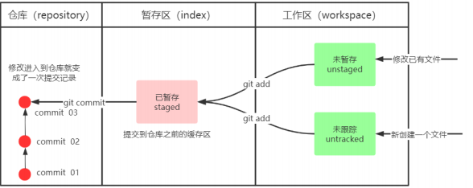

# git基础概念
[[toc]]  [//]: # (直接在文档里面写一个[[top]]就可以生成目录)

## git安装
下载地址：[https://git-scm.com/](https://git-scm.com/)

双击下载的安装文件来安装Git。安装完成后在电脑桌面（也可以是其他目录）点击右键，如果能够看
到如下两个菜单则说明Git安装成功。  
  
<font color='#b29400'>
Git Bash：Unix与Linux风格的命令行。使用最多，推荐最多  
Git CMD：Windows风格的命令行(此程序可以在开始菜单安装git应用中找到)  
GIT GUI：图形界面的Git。不建议初学者使用，尽量先熟悉常见命令  
</font>

## Git环境配置----设置用户名与邮箱
### 说明
<font color='b29400'>当你安装Git后首先要做的事情是设置你的**用户名称和e-mail地址**。这是非常重要的，因为每次Git提交都会使用该信息。它被永远的嵌入到了你的提交中，
也就是你提交中会包含这两个信息，告诉别人谁做了这次操作</font>
```
$ git config --global user.name '用户名'
$ git config --global user.email '邮箱地址'
```
1. 如果用了 --global 选项，那么更改的配置文件就是位于你用户主目录下的那个，以后你所有的项目都会默认使用这里配置的用户信息。
2. 如果要在某个特定的项目中使用其他名字或者电邮，只要去掉 –global 选项重新配置即可，新的设定保存在当前项目的 .git/config 文件里。
```
可以输入以下命令去查看当前配置
$ git config--list
$ git config --global user.name
$ git config --global user.email
```
## git 一些基本的命令操作总结
配置远程仓库：git remote add test http://xxxx/tool/device_management.git test为远程仓库别名<br/>
克隆远程仓库到本地：git clone http://XXX/tool/device_management.git<br/>
查看远程仓库：git remote -v<br/>
查看远程仓库所有分支：git branch -r<br/>
查看本地分支：git branch<br/>
创建本地分支：$ git branch [name] <br/>
切换分支：git checkout XXX(分支名字)<br/>
创建新分支并立即切换到新分支：git checkout -b XXX<br/>
创建远程分支(本地分支push到远程)：git push origin [name]<br/>
合并分支：git merge [name] ----将名称为[name]的分支与当前分支合并<br/>
删除远程分支wujuan: git push origin -d wujuan<br/>

## git本地仓库搭建
### <font color='green'>git状态区解释</font>    
**工作区：** 就是你在电脑里能看到的目录。  
**暂存区：** 英文叫stage, 或index。一般存放在 “.git目录下” 下的index文件（.git/index）中，所以我们把暂存区有时也叫作索引（index）。使用 <font color='red'>git add .</font> 提交至暂存区   
**版本库：** 工作区有一个隐藏目录.git，这个不算工作区，而是Git的版本库. 使用 <font color='red'>git commit -m '描述'</font>  提交至本地仓库  
 

### <font color='green'>1.Git 创建本地仓库</font>
**可以使用一个已经存在的目录作为Git仓库或创建一个空目录。使用您当前目录作为Git仓库，我们只需使它初始化**
```
git init
```
**使用我们指定目录作为Git仓库**
```
git init newrepo
```
**初始化后，在当前目录下会出现一个名为 .git 的目录，所有 Git 需要的数据和资源都存放在这个目录中。如果当前目录下有几个文件想要纳入版本控制，需要先用 git add 命令告诉 Git 开始对这些文件进行跟踪，然后提交**
```
$ git add *.c
$ git add README
$ git commit -m 'initial project version'
```
### <font color='green'>2.从现有仓库克隆</font>
**克隆仓库的命令格式为：**
```
git clone [url]
```
**比如，要克隆 Ruby 语言的 Git 代码仓库 Grit，可以用下面的命令：**
```
$ git clone git://github.com/schacon/grit.git
```
**执行该命令后，会在当前目录下创建一个名为grit的目录，其中包含一个 .git 的目录，用于保存下载下来的所有版本记录。如果要自己定义要新建的项目目录名称，可以在上面的命令末尾指定新的名字：**
```
$ git clone git://github.com/schacon/grit.git mygrit
```

 
